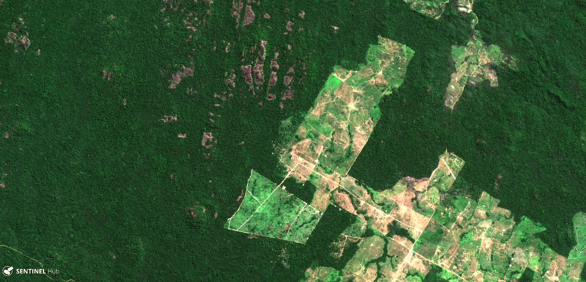
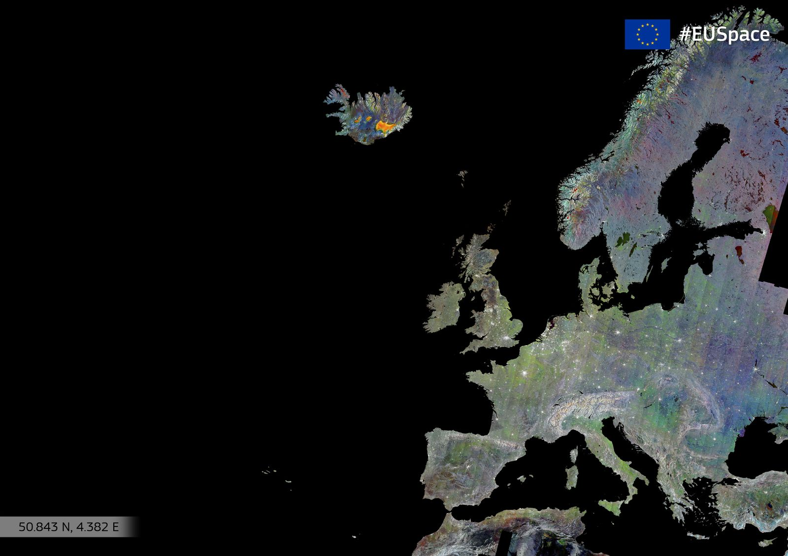
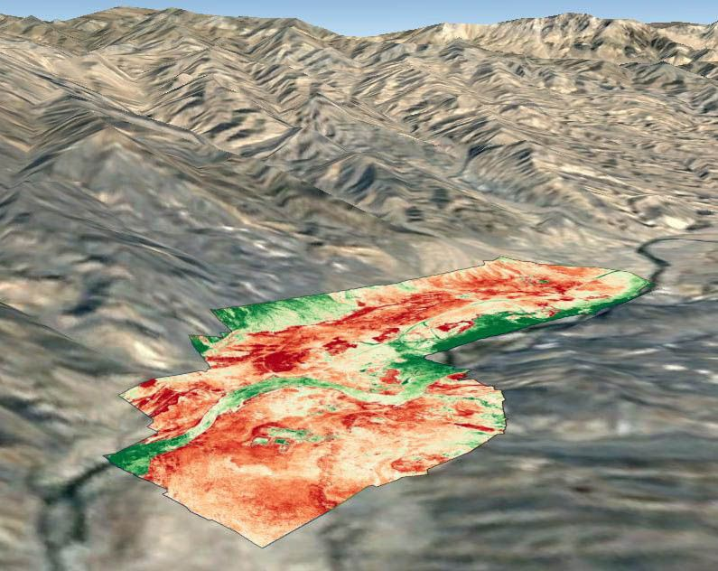
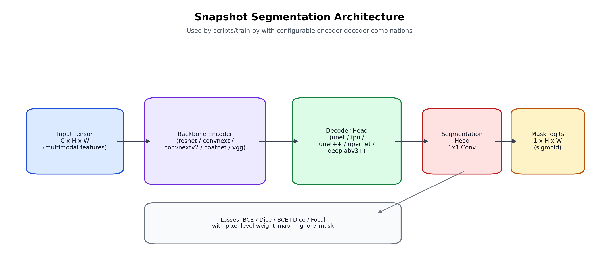
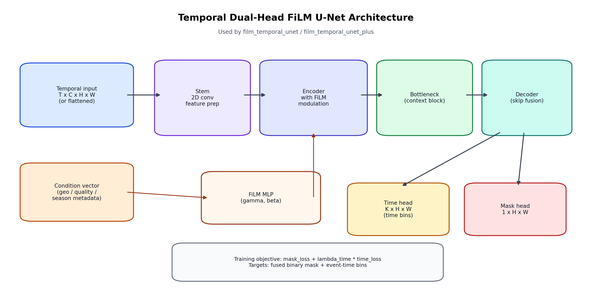
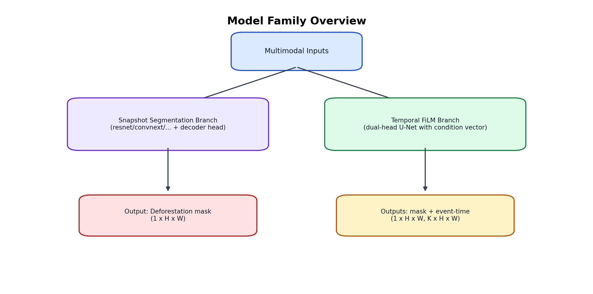

# Multimodal Deforestation Detection and Segmentation


A computer vision and geospatial ML project for pixel-level deforestation detection from multimodal satellite data.

This repository is maintained as a personal technical project by team **XylemX**. It was originally built during the **osapiens** Makeathon 2026 challenge and then expanded into a reproducible research-style pipeline.

## Visual Gallery

### Deforestation (Sentinel-2 example)



### Radar Context (Sentinel-1 mosaic)



### Vegetation Signal Example (NDVI)



Image sources and license details: [Image Attribution](content/images/ATTRIBUTION.md)

## Why This Project Matters

Deforestation monitoring is a high-impact real-world problem for climate, biodiversity, and supply-chain transparency. Regulations such as EUDR increase the need for systems that can detect forest-loss events reliably at scale, across regions with different weather, terrain, and sensor quality.

The core challenge is not only model accuracy. It is handling noisy, heterogeneous, and partially conflicting observations from space while still producing stable segmentation outputs.

## Data From Space: Modalities And Label Sources

All model inputs come from satellite or satellite-derived products:

- **Sentinel-2 (optical, multispectral)** time series (`12` spectral bands per scene).
- **Sentinel-1 (radar, RTC)** time series, robust to cloud cover and illumination changes.
- **AEF embeddings** (foundation-model-style per-pixel features, provided as yearly rasters).

Training supervision is weakly labeled and fused from three alert systems:

- **RADD**
- **GLAD-L**
- **GLAD-S2**

Data layout expected by the pipeline:

```text
data/makeathon-challenge/
├── sentinel-1/
├── sentinel-2/
├── aef-embeddings/
├── labels/train/
│   ├── gladl/
│   ├── glads2/
│   └── radd/
└── metadata/
```

### Data Semantics Used In This Repository

#### Sentinel-2 (optical) bands used in features

The preprocessing code uses these 12 bands (`src/xylemx/preprocessing/features.py`):  
`B01`, `B02`, `B03`, `B04`, `B05`, `B06`, `B07`, `B08`, `B8A`, `B09`, `B11`, `B12`.

`B10` (cirrus) is not used in the current feature stack.

| Band | Typical name | Native GSD | Why it helps for deforestation monitoring |
|---|---|---:|---|
| B01 | Coastal aerosol | 60 m | atmospheric effects and haze-sensitive observations |
| B02 | Blue | 10 m | water/haze separation and visible-spectrum context |
| B03 | Green | 10 m | vegetation vigor and canopy reflectance context |
| B04 | Red | 10 m | chlorophyll absorption, key for vegetation indices |
| B05 | Red-edge 1 | 20 m | canopy stress and vegetation structure sensitivity |
| B06 | Red-edge 2 | 20 m | vegetation condition and subtle canopy changes |
| B07 | Red-edge 3 | 20 m | biomass/leaf structure response in dense vegetation |
| B08 | NIR (broad) | 10 m | strong vegetation signal; central in NDVI/NBR |
| B8A | NIR (narrow) | 20 m | additional vegetation discrimination in dense canopies |
| B09 | Water vapor | 60 m | atmospheric moisture context for quality filtering |
| B11 | SWIR1 | 20 m | moisture/stress and disturbed-ground sensitivity |
| B12 | SWIR2 | 20 m | burn/disturbance signal, important for NBR dynamics |

Derived indices used by the temporal pipeline:

- `NDVI = (B08 - B04) / (B08 + B04)`
- `NBR = (B08 - B12) / (B08 + B12)`

#### Sentinel-1 (radar) representation in this code

- Input files are monthly RTC rasters with orbit suffixes (`ascending` / `descending`).
- The current snapshot preprocessing uses one radar band per file (first raster band).
- If both orbits exist for a month, they are averaged per pixel into a single monthly S1 channel.
- This adds cloud-robust structural change information complementary to optical features.

#### AEF embeddings representation

- AEF inputs are yearly per-pixel embedding rasters (`{tile}_{year}.tiff`).
- Because raw embedding channels are high-dimensional and not directly interpretable, the pipeline fits PCA on train tiles and keeps `aef_pca_dim` components (default `8`, often `12` in tuned runs).
- The PCA-compressed channels are then aligned to the Sentinel-2 master grid and used as model features.

#### Weak labels in the training data

The project uses weak supervision from `RADD`, `GLAD-L`, and `GLAD-S2`, then fuses them.

| Source | What we ingest | Main decoding behavior in repo |
|---|---|---|
| RADD | `radd_{tile}_labels.tif` | Snapshot pipeline supports `permissive` (`raw > 0`) and `conservative` (`raw // 10000 >= 3`) modes; temporal pipeline also decodes confidence/date fields. |
| GLAD-L | yearly `alert` + `alertDate` files | Yearly alerts are thresholded (default `>=2`) and merged across years (logical OR) into one source mask. |
| GLAD-S2 | `alert` + `alertDate` files | Alert classes are thresholded (default depends on track), with optional confidence-aware filtering in temporal preprocessing. |

The fused supervision contains `target`, `soft_target`, `ignore_mask`, `weight_map`, `vote_count`, and `available_sources`.

### Data And Label Resources

Project-local references:

- [Challenge Brief](osapiens-challenge-full-description.md)
- [Pipeline Overview](docs/pipeline-overview.md)
- [Weak Label Fusion (repo implementation)](docs/weak-label-fusion.md)
- [Project Technical Guide](docs/project-technical-guide.md)

External references:

- Sentinel-2 mission overview (ESA): <https://www.esa.int/Applications/Observing_the_Earth/Copernicus/Sentinel-2>
- Sentinel-1 mission overview (ESA): <https://www.esa.int/Applications/Observing_the_Earth/Copernicus/Sentinel-1/Introducing_the_Sentinel-1_mission>
- Sentinel-2 band wavelengths and names (NASA HLS spectral reference): <https://www.earthdata.nasa.gov/data/projects/hls/spectral-bands>
- GLAD-L / GLAD-S2 dataset description (UMD GLAD): <https://glad.geog.umd.edu/dataset/glad-forest-alerts>
- RADD overview and context (Global Forest Watch): <https://www.globalforestwatch.org/blog/data-and-research/radd-radar-alerts/>
- RADD + GLAD integration research reference (Wageningen University): <https://research.wur.nl/en/publications/integrating-satellite-based-forest-disturbance-alerts-improves-de/>

## What The System Does

High-level pipeline:

1. Scan challenge tiles and resolve multimodal file sets.
2. Reproject all modalities and weak labels to a common Sentinel-2 reference grid.
3. Decode weak labels and fuse them into training supervision.
4. Build feature tensors, validity masks, and normalization statistics.
5. Train segmentation (and optionally temporal multitask) models.
6. Run sliding-window inference and export GeoTIFF prediction masks.
7. Convert prediction masks into GeoJSON submission artifacts.

## Preprocessing, Label Noise, And Fusion

### Preprocessing

Implemented in `src/xylemx/preprocessing/` and `src/xylemx/temporal/preprocessing.py`:

- Spatial alignment to the Sentinel-2 grid for pixel-wise consistency.
- Snapshot feature modes:
  - `snapshot_pair`: early + late + delta
  - `snapshot_quad`: early + middle1 + middle2 + late + delta
- Optional multimodal inclusion (`use_s1_features`, `use_aef_features`).
- Train-only normalization statistics with clipping and robust handling of missing values.

### Label Challenge

Weak labels are imperfect and often disagree across sources. The project explicitly models this uncertainty instead of treating any single source as ground truth.

Label logic includes:

- source-specific decoding (`RADD`, `GLAD-L`, `GLAD-S2`)
- configurable thresholds and confidence handling
- fusion rules: `consensus_2of3`, `union`, `unanimous`, `soft_vote`
- per-pixel outputs: `target`, `soft_target`, `ignore_mask`, `weight_map`, `vote_count`

This makes training more robust in noisy supervision settings.

## Models

### 1) Segmentation Models (snapshot pipelines)

From `src/xylemx/models/`:

- Native: `small_unet`, `coatnext_tiny_unet`
- Timm encoder + decoder combinations (`_unet`, `_fpn`, `_unetpp`, `_upernet`, `_deeplabv3plus`, optional `_cbam`)
- Example model names:
  - `resnet18_unet`
  - `resnet50_fpn`
  - `convnext_tiny_upernet`
  - `convnextv2_tiny_unetpp`

### 2) Temporal Multitask Models

From `src/xylemx/temporal/model.py`:

- `film_temporal_unet`
- `film_temporal_unet_plus`

Both output:

- binary deforestation mask logits
- event-time logits (time-bin classification)

### Model Architecture Diagrams

#### Snapshot segmentation architecture



#### Temporal dual-head FiLM architecture



#### Model family overview



To regenerate these diagrams:

```bash
.venv/bin/python scripts/generate_model_architecture_diagrams.py
```

## Getting Started

### 1) Environment setup

```bash
python3.10 -m venv .venv
source .venv/bin/activate
python -m pip install --upgrade pip
python -m pip install -r requirements.txt
python -m pip install -e .
```

### 2) Download data (Python, not Make)

```bash
python download_data.py \
  --bucket_name osapiens-terra-challenge \
  --folder_name makeathon-challenge \
  --local_dir ./data
```

This creates `data/makeathon-challenge/`.

### 3) Run baseline preprocessing

```bash
python scripts/preprocess.py \
  --data-root data/makeathon-challenge \
  --output-dir output/preprocessing \
  --preprocessing-num-workers 4
```

### 4) Train baseline model

```bash
python scripts/train.py \
  preprocessing_dir=output/preprocessing \
  output_root=output/training_runs \
  model=resnet18_unet \
  epochs=40 \
  batch_size=4
```

Notes:

- `scripts/train.py` uses `key=value` overrides.
- Runs are stored under `output/training_runs/<timestamp_model...>/`.
- Best checkpoint is saved to `checkpoints/best.pt`.

### 5) Run inference

```bash
python scripts/predict.py \
  checkpoint=output/training_runs/<run_name>/checkpoints/best.pt \
  split=val \
  output_dir=output/predictions/<run_name> \
  threshold=0.5
```

### 6) Build submission GeoJSON files

```bash
python scripts/make_submission.py \
  prediction_dir=output/predictions/<run_name> \
  output_dir=output/submissions/<run_name> \
  min_area_ha=0.5
```

## Additional Pipelines

- **Leaderboard track**
  - `python scripts/preprocessing_leaderboard.py --data-root data/makeathon-challenge --output-dir output/preprocessing_leaderboard`
  - `python scripts/train_leaderboard.py --data-root data/makeathon-challenge --preprocessing-dir output/preprocessing_leaderboard`

- **Temporal HQ track**
  - `python scripts/preprocessing_temporal_hq.py --data-root data/makeathon-challenge --output-dir output/preprocessing_temporal_hq`
  - `python scripts/train_temporal_hq.py data_root=data/makeathon-challenge preprocessing_dir=output/preprocessing_temporal_hq`

- **Single-2025 track**
  - `python scripts/preprocessing_single_2025.py --data-root data/makeathon-challenge --output-dir output/preprocessing_single_2025`
  - `python scripts/train_single_2025.py --data-root data/makeathon-challenge --preprocessing-dir output/preprocessing_single_2025`

## Repository Structure

```text
makeathon-challenge-2026-xylemx/
├── README.md
├── scripts/
├── src/xylemx/
├── docs/
├── tests/
├── jobs/
└── output/  # generated artifacts
```

## Documentation

- [Pipeline Overview](docs/pipeline-overview.md)
- [Project Technical Guide](docs/project-technical-guide.md)
- [Weak Label Fusion](docs/weak-label-fusion.md)
- [Baseline Pipeline](docs/baseline-pipeline.md)
- [SLURM Jobs](jobs/README.md)
