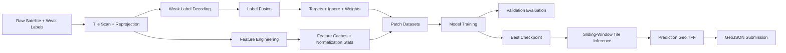

# XylemX Pipeline Overview

This document explains the complete pipeline across:

- different preprocessing tracks
- model families
- weak-label fusion
- evaluation and model selection

It is intended as a practical "how the whole system fits together" guide.

---

## 1) Pipeline Families At A Glance

| Track | Preprocessing Entrypoint | Training Entrypoint | Main Goal | Output Root |
|---|---|---|---|---|
| Baseline (snapshot) | `scripts/preprocess.py` | `scripts/train.py` | Binary deforestation segmentation | `output/training_runs` (default) |
| Leaderboard (snapshot, tuned) | `scripts/preprocessing_leaderboard.py` | `scripts/train_leaderboard.py` | Robust model/threshold selection | `output/training_runs_leaderboard` |
| Temporal | `scripts/preprocessing_temporal.py` | `scripts/train_temporal.py` | Segmentation + time-bin prediction | `output/temporal_runs` |
| Temporal HQ | `scripts/preprocessing_temporal_hq.py` | `scripts/train_temporal_hq.py` | Stronger temporal generalization | `output/temporal_runs_hq` |
| Single 2025 | `scripts/preprocessing_single_2025.py` | `scripts/train_single_2025.py` | Single-date summer-2025 segmentation | `output/train_runs_single_2025` |

---

## 2) Common End-To-End Flow



Shared design points:

- Sentinel-2 reference grid is the master spatial grid for alignment.
- Weak labels are fused into supervision (`target`, `ignore_mask`, `weight_map`).
- Training uses patch sampling; inference is stitched sliding-window tile prediction.

---

## 3) Preprocessing Pipelines

## 3.1 Baseline / Snapshot (`xylemx.preprocessing.pipeline`)

### Inputs

- Sentinel-2 monthly rasters
- Optional Sentinel-1 monthly rasters
- Optional AEF embeddings (projected with PCA)
- Weak labels: RADD, GLAD-L, GLAD-S2

### Feature Modes

- `snapshot_pair`: early + late + delta
- `snapshot_quad`: early + middle1 + middle2 + late + delta

Channel count formulas:

- `snapshot_pair`: `C = 39 + 3p`
- `snapshot_quad`: `C = 65 + 5p`
- `p = aef_pca_dim`

### Outputs

- `features/{split}/{tile}.npy`
- `valid_masks/{split}/{tile}.npy`
- `targets/{tile}.npy`
- `ignore_masks/{tile}.npy`
- `weight_maps/{tile}.npy`
- `normalization_stats.json`
- `train_tiles.json`, `val_tiles.json`

## 3.2 Leaderboard Preprocessing

Uses the same baseline preprocessing engine with stronger defaults:

- `temporal_feature_mode=snapshot_quad`
- stricter snapshot quality control
- S1 and AEF enabled by default
- more aggressive clipping/normalization settings

Entrypoint: `scripts/preprocessing_leaderboard.py`

## 3.3 Temporal Preprocessing (`xylemx.temporal.preprocessing`)

Builds a monthly sequence between `time_start` and `time_end`, then generates:

- temporal input tensor (`sequence` or summarized form)
- binary segmentation target
- per-pixel time-bin target
- condition vector (optional)

Representations:

1. `sequence`
2. `summary`
3. `early_middle_late_deltas`

Time bins:

- `year`, `month`, or `quarter`

Temporal outputs include:

- `inputs/{split}/{tile}.npy`
- `conditions/{split}/{tile}.npy`
- `targets/mask/{tile}.npy`
- `targets/time/{tile}.npy`
- `time_bins.json`
- `temporal_spec.json`

## 3.4 Temporal HQ Preprocessing

Uses temporal preprocessing with stronger defaults:

- `representation=early_middle_late_deltas`
- multimodal S2 + S1 + AEF
- richer condition vector
- stricter confidence/uncertainty settings

Entrypoint: `scripts/preprocessing_temporal_hq.py`

## 3.5 Single-2025 Preprocessing (`xylemx.single_2025.preprocessing`)

Selects a single target-year summer snapshot (default year `2025`, months `6,7,8`):

- S2 summer snapshot
- optional S1 snapshot (aligned/preferred month)
- optional AEF PCA for target year

Special controls:

- `strict_summer_only`
- `target_year`
- `summer_months`

---

## 4) Label Fusion (Core Supervision Logic)

Weak sources:

- RADD
- GLAD-L
- GLAD-S2

For each pixel `x`:

- `v(x) = sum of positive source votes`
- `a(x) = number of available sources`
- `soft(x) = v(x) / max(a(x), 1)`

Fusion mode options:

- `consensus_2of3`
- `union`
- `unanimous`
- `soft_vote`

Weight map by vote count:

- `vote=0 -> vote_weight_0`
- `vote=1 -> vote_weight_1`
- `vote=2 -> vote_weight_2`
- `vote>=3 -> vote_weight_3`

Ignore mask may include:

- outside label extent
- uncertain single-source positives (optional)

Temporal track also merges event dates across sources using:

- `highest_confidence`, `earliest`, or `median`

then maps dates to bin indices for time-head training.

---

## 5) Model Pipelines

## 5.1 Non-temporal Segmentation Models

Builder: `xylemx.models.baseline.build_model`

Families:

- `small_unet`
- `coatnext_tiny_unet`
- timm encoder + head combinations:
1. `_unet`
2. `_fpn`
3. `_unetpp`
4. `_upernet`
5. `_deeplabv3plus`
6. optional `_cbam` attention variants

Example names:

- `resnet34_unet`
- `resnet50_fpn`
- `convnext_tiny_deeplabv3plus_cbam`
- `convnextv2_tiny_unetpp`

## 5.2 Temporal Models

Builders in `xylemx.temporal.training._build_model`:

- `film_temporal_unet` (`DualHeadUNet`)
- `film_temporal_unet_plus` (`DualHeadUNetPlus`)

Dual outputs:

- `mask_logits` for segmentation
- `time_logits` for event-time class

---

## 6) Training And Evaluation

## 6.1 Baseline Training (`xylemx.training.train`)

Training evaluates two levels:

1. Patch-level validation (`_evaluate_patch_loader`)
2. Tile-level stitched validation (`_evaluate_tiles`) for model selection

Best checkpoint criterion:

- maximize validation Dice from tile-level evaluation

Losses:

- `bce`, `dice`, `bce_dice`, `focal`

Optional training features:

- mixed precision
- EMA
- CutMix / MixUp
- TTA at tile inference

## 6.2 Leaderboard Training (`scripts/train_leaderboard.py`)

Pipeline:

1. Train candidate models for search epochs
2. Rank by selected metric (`iou`, `f1`, or `dice`)
3. Optional threshold calibration sweep
4. Retrain selected model for final epochs

Threshold calibration computes metrics over predefined thresholds and selects the best one.

## 6.3 Temporal Training (`xylemx.temporal.training`)

Loss:

- `L_total = L_mask + lambda_time * time_loss_weight * L_time`

Validation reports:

- segmentation metrics (`iou`, `dice`, etc.)
- temporal metrics (`time_accuracy`, `time_mae_bins`)

Checkpoint ranking score:

- `score = val_dice + 0.25 * val_time_accuracy`

---

## 7) Metric Definitions

From confusion counts `(TP, FP, FN, TN)`:

- `IoU = TP / (TP + FP + FN)`
- `Dice (F1) = 2TP / (2TP + FP + FN)`
- `Precision = TP / (TP + FP)`
- `Recall = TP / (TP + FN)`
- `Accuracy = (TP + TN) / (TP + FP + FN + TN)`

Temporal metrics:

- time accuracy over valid non-ignored time pixels
- mean absolute error in bin index space

---

## 8) Practical Runbooks

## 8.1 Baseline

```bash
./.venv/bin/python scripts/preprocess.py \
  --data-root data/makeathon-challenge \
  --output-dir output/preprocessing

./.venv/bin/python scripts/train.py \
  preprocessing_dir=output/preprocessing \
  model=resnet34_fpn \
  epochs=40
```

## 8.2 Leaderboard

```bash
./.venv/bin/python scripts/preprocessing_leaderboard.py \
  --data-root data/makeathon-challenge \
  --output-dir output/preprocessing_leaderboard

./.venv/bin/python scripts/train_leaderboard.py \
  --preprocessing-dir output/preprocessing_leaderboard \
  --selection-metric iou \
  --calibrate-threshold
```

## 8.3 Temporal HQ

```bash
./.venv/bin/python scripts/preprocessing_temporal_hq.py \
  --data-root data/makeathon-challenge \
  --output-dir output/preprocessing_temporal_hq

./.venv/bin/python scripts/train_temporal_hq.py
```

## 8.4 Single 2025

```bash
./.venv/bin/python scripts/preprocessing_single_2025.py \
  --data-root data/makeathon-challenge \
  --output-dir output/preprocessing_single_2025 \
  --target-year 2025 \
  --summer-months 6,7,8

./.venv/bin/python scripts/train_single_2025.py \
  --preprocessing-dir output/preprocessing_single_2025
```

---

## 9) Notes

- The canonical training/evaluation APIs are the `scripts/` entrypoints.
- Some `jobs/` templates are legacy and may require argument updates before direct use.
- For deeper implementation details, see:
1. `docs/project-technical-guide.md`
2. `docs/weak-label-fusion.md`
3. `docs/baseline-pipeline.md`
