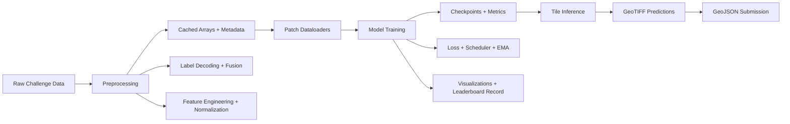

# XylemX Project Technical Guide

This document is a full-project technical reference for the `makeathon-challenge-2026-xylemx` repository.

It covers:

- system design and architecture
- data contracts and file formats
- mathematical definitions used in preprocessing, training, and evaluation
- baseline, leaderboard, temporal, and single-2025 pipelines
- module-level responsibilities across `src/`, `scripts/`, `jobs/`, and `tests/`
- known operational caveats

---

## 1) Project Scope

`XylemX` is a geospatial ML system for deforestation detection from multimodal satellite data. The repository contains three major modeling tracks:

1. Non-temporal segmentation baseline (multimodal snapshot features).
2. Temporal multitask pipeline (segmentation + event-time prediction).
3. Single-date summer-2025 pipeline (focused simplified variant).

Core package: `src/xylemx/`  
Primary automation entrypoints: `scripts/` plus root wrappers (`train.py`, `preprocess.py`, etc.).

---

## 2) Architecture Design

### 2.1 High-level System Diagram



### 2.2 Design Principles in Code

- Sentinel-2 grid is the spatial reference grid for reprojection/alignment.
- Weak labels are fused instead of treated as perfect ground truth.
- All training uses ignore masks and pixel-weight maps.
- Preprocessing artifacts are cached and reusable.
- Configuration is flat `key=value` for script ergonomics.
- Temporal pipeline uses multitask supervision: binary mask + time bin.

---

## 3) Repository Map (Whole Project)

### 3.1 Top-level

- `README.md`: challenge + baseline overview.
- `osapiens-challenge-full-description.md`: challenge brief.
- `challenge.ipynb`: exploratory walkthrough.
- `download_data.py`: S3 dataset download utility.
- `submission_utils.py`: raster-to-GeoJSON conversion.
- `pyproject.toml`: package config (`xylemx`).
- `requirements.txt`: pinned environment.
- `Makefile`: venv install and data download helper.
- Root wrappers: `preprocess.py`, `train.py`, `predict.py`, `train_temporal.py`, etc.

### 3.2 Source Package (`src/xylemx/`)

- `config.py`, `experiment.py`: config parsing + run bookkeeping.
- `data/`: tile scanning, reprojection IO, patch tiling, datasets.
- `labels/`: weak label decoding + consensus fusion.
- `preprocessing/`: multimodal feature construction + normalization + pipeline.
- `models/`: segmentation architectures + loss builders + model registry.
- `training/`: trainer, inference stitcher, metrics, augmentations.
- `temporal/`: temporal preprocessing, model, losses, dataset, trainer, inference.
- `single_2025/`: single-date (summer-2025) preprocessing track.
- `visualization/`: qualitative rendering helpers.

### 3.3 Automation and Ops

- `scripts/` (13 files): official CLI entrypoints.
- `jobs/` (15 files): SLURM/local orchestration templates.
- `tests/` (7 files): regression/unit tests for core mechanics.
- `docs/`: technical documentation pages.

### 3.4 Generated / Experiment Artifacts

The `output/` tree contains cached preprocessing and run results:

- `output/preprocessing*`
- `output/train*_runs*`
- `output/temporal_runs*`

These are generated state, not source logic.

---

## 4) Data and Geometry Contracts

### 4.1 Master Grid Design

For each tile, all modalities and labels are reprojected to Sentinel-2 reference grid:

- CRS: `CRS_s2`
- transform: `T_s2`
- spatial size: `(H, W)`

So tensors are spatially aligned pixel-for-pixel.

### 4.2 Naming Patterns

- Sentinel-2: `{tile}__s2_l2a_{year}_{month}.tif`
- Sentinel-1: `{tile}__s1_rtc_{year}_{month}_{orbit}.tif`
- AEF: `{tile}_{year}.tiff`

Regex patterns are enforced in `xylemx.data.io`.

---

## 5) Weak Labels and Fusion Math

### 5.1 Decoding

For pixel value `r` in RADD:

- `class(r) = floor(r / 10000)`
- `days(r) = r mod 10000`
- positive if `class in {2,3}` and `days > 0`

GLAD-S2 and GLAD-L are decoded from alert/alertDate pairs into:

- `is_positive`
- `confidence_score`
- `event_date`
- `raw_class`
- `valid_mask`

### 5.2 Fusion

Let source set `S = {radd, gladl, glads2}`.

For pixel `x`:

- vote count: `v(x) = Σ_s L_s(x)`
- available sources: `a(x) = Σ_s V_s(x)`
- soft target: `t_soft(x) = v(x)/max(a(x),1)`

Consensus target examples:

- `consensus_2of3`: `y(x) = 1[v(x) >= 2]`
- `union`: `1[v(x) >= 1]`
- `unanimous`: `1[v(x) = |S|]`
- `soft_vote`: `1[t_soft(x) >= τ]`

Weight map by agreement:

- `w = w0` when `v=0`
- `w = w1` when `v=1`
- `w = w2` when `v=2`
- `w = w3` when `v>=3`

Ignore mask includes out-of-extent and optionally uncertain single-source positives.

---

## 6) Feature Engineering Design

### 6.1 Non-temporal Snapshot Pipeline (`xylemx.preprocessing`)

Modes:

- `snapshot_pair`: stages `early`, `late`, plus `delta = late - early`
- `snapshot_quad`: stages `early`, `middle1`, `middle2`, `late`, plus `delta`

Modalities:

- S2 bands (`12` channels per stage)
- S1 monthly aggregate (`1` channel per stage)
- AEF PCA (`p` channels per stage, `p=aef_pca_dim`)

Channel counts:

- `snapshot_pair`: `C = 39 + 3p` (for `p=8`, `C=63`)
- `snapshot_quad`: `C = 65 + 5p` (for `p=8`, `C=105`)

### 6.2 Temporal Pipeline (`xylemx.temporal.preprocessing`)

Builds monthly sequence between `time_start` and `time_end`:

- per-step channels include selected modalities + optional validity channels
- representations:
1. `sequence`
2. `summary` (window means + global delta)
3. `early_middle_late_deltas` (early, middle, late and pairwise deltas)

S2 indices:

- `NDVI = (NIR - RED) / (NIR + RED)`
- `NBR = (NIR - SWIR2) / (NIR + SWIR2)`

Temporal labels:

- event dates merged across sources (`highest_confidence`, `earliest`, `median`)
- mapped to bins (`year`, `month`, `quarter`)

### 6.3 Single-Date 2025 Pipeline (`xylemx.single_2025`)

Builds one summer 2025 snapshot:

- target year configurable (default `2025`)
- month subset configurable (default `6,7,8`)
- optional strict mode requiring true summer matches
- features: S2 + optional S1 + optional AEF PCA

---

## 7) Normalization and Statistics

Normalization is fit on train tiles only:

- per-channel mean/std (streaming estimator)
- optional percentile clipping using reservoir sampling
- finite-value filling with channel means

Normalized tensor:

`x_norm = clip(x, lo, hi)`  
`x_norm = (x_norm - μ) / max(σ, ε)`

---

## 8) Models and Training Math

### 8.1 Segmentation Models (`xylemx.models`)

Registry supports:

- `small_unet`
- `coatnext_tiny_unet`
- timm-encoder combinations:
1. heads: `_unet`, `_fpn`, `_unetpp`, `_upernet`, `_deeplabv3plus`
2. optional `_cbam` variants
3. encoders: ResNet, EfficientNet, ConvNeXt, ConvNeXtV2, CoAtNet, VGG aliases

### 8.2 Losses (`xylemx.models.losses`)

Weighted BCE:

`L_bce = Σ_i w_i * BCEWithLogits(z_i, y_i) / Σ_i w_i`

Dice:

`L_dice = 1 - (2 Σ_i w_i p_i y_i + s)/(Σ_i w_i p_i + Σ_i w_i y_i + s)`

Focal:

`L_focal = Σ_i w_i * (1-p_t)^γ * BCE_i / Σ_i w_i`

Composite:

`L = α * L_bce + β * L_dice` for `bce_dice`.

### 8.3 Temporal Multitask Loss

`L_total = L_mask + λ_time * w_time * L_time`

- `L_mask`: segmentation loss above
- `L_time`: cross entropy over valid time bins
- time loss is only meaningful on non-ignored pixels with valid time targets

### 8.4 Scheduler

Cosine with warmup:

- warmup epochs: linear ramp
- then `lr_scale = 0.5*(1 + cos(pi*progress))`
- clipped at `min_lr / lr`

---

## 9) Evaluation Metrics

From confusion counts `(TP, FP, FN, TN)`:

- `IoU = TP / (TP + FP + FN)`
- `Dice = 2TP / (2TP + FP + FN)`
- `Precision = TP / (TP + FP)`
- `Recall = TP / (TP + FN)`
- `Accuracy = (TP + TN) / (TP + FP + FN + TN)`

Temporal adds:

- time accuracy (class equality over valid pixels)
- time MAE in bin index space

---

## 10) Runtime Workflow Design

### 10.1 Baseline

1. `scripts/preprocess.py` -> cached features/targets/splits.
2. `scripts/train.py` -> run directory, checkpoints, metrics, visualizations.
3. `scripts/predict.py` -> stitched full-tile probabilities and binary rasters.
4. `scripts/make_submission.py` -> GeoJSON export and optional zip bundle.

### 10.2 Leaderboard Track

- `scripts/preprocessing_leaderboard.py`: stronger defaults.
- `scripts/train_leaderboard.py`: candidate search, selection, optional threshold calibration, final retrain.

### 10.3 Temporal Track

- `scripts/preprocessing_temporal.py` or `scripts/preprocessing_temporal_hq.py`
- `scripts/train_temporal.py` or `scripts/train_temporal_hq.py`

Outputs include mask rasters and optional time-bin rasters.

### 10.4 Single-2025 Track

- `scripts/preprocessing_single_2025.py`
- `scripts/train_single_2025.py`

---

## 11) Script and Module Inventory (Practical)

### 11.1 `scripts/` Entry Points

- `preprocess.py`: baseline preprocessing
- `train.py`: baseline training
- `predict.py`: checkpoint inference/export
- `make_submission.py`: prediction rasters -> GeoJSON
- `preprocessing_leaderboard.py`, `train_leaderboard.py`
- `preprocessing_temporal.py`, `train_temporal.py`
- `preprocessing_temporal_hq.py`, `train_temporal_hq.py`
- `preprocessing_single_2025.py`, `train_single_2025.py`
- `run_all_models_gpu.sh` (legacy helper)

### 11.2 `jobs/` Templates

SLURM and local runner templates exist for preprocess/train/predict orchestration.

Important note: several job/local scripts still pass deprecated CLI keys (`stride`, `use_amp`, `oversample_positives`, `output_dir`, `train_split`, etc.) and old model names (`vgg_unet`, `convnext_unet`, `coatnet_unet`) that do not match current config/model registry contracts. These templates should be treated as legacy and updated before production use.

### 11.3 `tests/` Coverage

- config parsing behavior
- experiment leaderboard append/sort
- feature aggregation and channel naming
- label fusion behavior
- model registry + representative forward passes
- submission geojson conversion
- temporal label binning/merge logic

---

## 12) Artifacts and Run Directory Design

Training run directory (created by `create_run_directory`) includes:

- `artifacts/`
- `checkpoints/` (`last.pt`, `best.pt`)
- `metrics/` (`history.json`, `summary.json`, curves)
- `predictions/val`, `predictions/test`
- `visualizations/`

Shared leaderboard files at output roots:

- `leaderboard.json`
- `leaderboard.csv`

---

## 13) Configuration Design

Two main config dataclasses:

- `ExperimentConfig` (baseline/snapshot pipelines)
- `TemporalPreprocessingConfig` + `TemporalTrainConfig` (temporal)

CLI format:

- `python scripts/train.py model=resnet34_fpn epochs=50 ...`
- optional config file: `config=path/to/file.yaml`

Unknown keys fail fast with `KeyError`.

---

## 14) Recommended Command Sequences

### Baseline

```bash
./.venv/bin/python scripts/preprocess.py \
  --data-root data/makeathon-challenge \
  --output-dir output/preprocessing

./.venv/bin/python scripts/train.py \
  preprocessing_dir=output/preprocessing \
  model=resnet34_fpn \
  epochs=40

./.venv/bin/python scripts/predict.py \
  checkpoint=output/training_runs/<run>/checkpoints/best.pt \
  split=test \
  output_dir=output/predictions/<run>
```

### Temporal HQ

```bash
./.venv/bin/python scripts/preprocessing_temporal_hq.py \
  --data-root data/makeathon-challenge \
  --output-dir output/preprocessing_temporal_hq

./.venv/bin/python scripts/train_temporal_hq.py
```

---

## 15) Extension Design Guidance

To extend safely:

1. Add new config fields in `config.py` or `temporal/config.py`.
2. Keep preprocessing outputs schema-stable (`feature_spec`, `normalization_stats`, splits).
3. Register new models via `build_model` and include tests in `tests/test_model_registry.py`.
4. Keep raster alignment on Sentinel-2 master grid.
5. Update script defaults and job templates together to avoid interface drift.

---

## 16) Known Risks and Technical Debt

- Legacy job/bash templates are not fully synchronized with current CLI schema.
- `build/lib/` and `src/` duplicate package trees exist; source of truth should remain `src/`.
- Existing `output/` artifacts can be large and environment-specific.
- Matplotlib may warn if `MPLCONFIGDIR` is not writable in restricted environments.

---

## 17) Quick Reference of Core Equations

- Fusion soft vote: `t_soft = votes / available_sources`
- BCE-Dice combined loss: `L = αL_bce + βL_dice`
- Temporal multitask loss: `L = L_mask + λL_time`
- Dice: `2TP / (2TP + FP + FN)`
- IoU: `TP / (TP + FP + FN)`
- NDVI: `(NIR - RED) / (NIR + RED)`
- NBR: `(NIR - SWIR2) / (NIR + SWIR2)`

This equation set mirrors the implemented training and preprocessing behavior in the current codebase.
